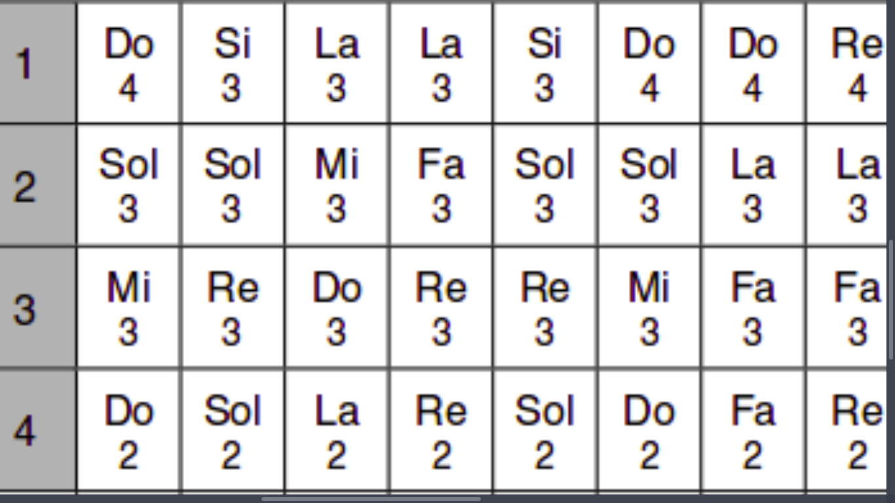
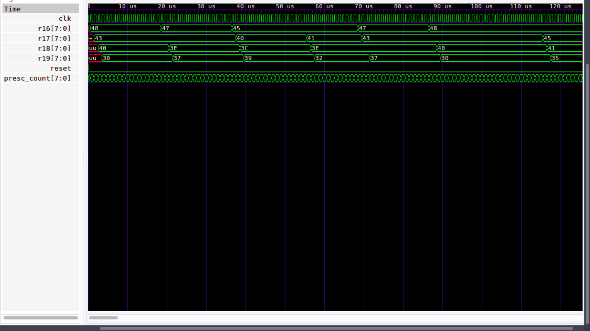
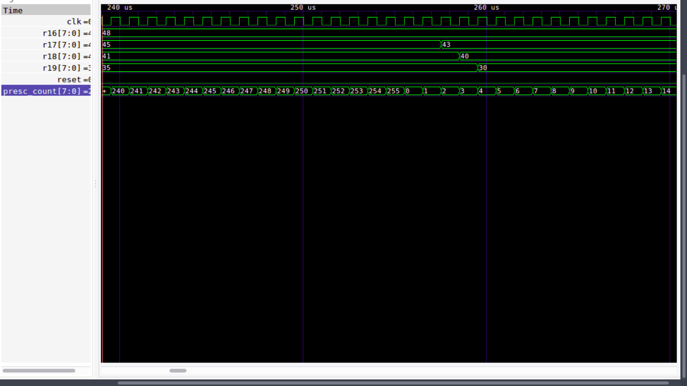
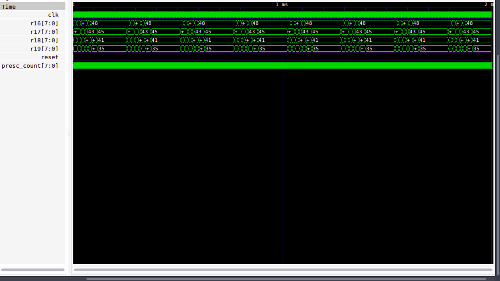

# Previs

  **Amb les instruccions creades a classe, escriviu un codi que pugui esperar
la quantitat de temps demanada per la partitura i alterni diferents notes creant
una melodia senzilla. Adjunteu tot el codi del mini AVR.**


  **Codi vhdl AVR de la partitura següent, corresponent al sintetitzador següent:**

  **Partitura:**

  {width=85%}


  **AVR:**

```Vhdl
library ieee;
use ieee.std_logic_1164.all;
use ieee.numeric_std.all;

entity mini_avr_01 is
port (clk : in std_logic;
      reset : in std_logic;
      -- Let's have some registers as outputs :
      r16 : out std_logic_vector(7 downto 0);
      r17 : out std_logic_vector(7 downto 0);
      r18 : out std_logic_vector(7 downto 0);
      r19 : out std_logic_vector(7 downto 0));

end mini_avr_01;

architecture behav of mini_avr_01 is

  constant NOP : std_logic_vector(3 downto 0) := "0000";
  constant LDI : std_logic_vector(3 downto 0) := "1110";
constant ADC : std_logic_vector(3 downto 0) := "0001";
constant MOV : std_logic_vector(3 downto 0) := "0010";
constant RJMP : std_logic_vector(3 downto 0) := "1100";
constant BREQ : std_logic_vector(3 downto 0) := "1111";
constant BRNE : std_logic_vector(3 downto 0) := "0011";
constant ALU_MOV : std_logic_vector(2 downto 0) := "010";
constant ALU_ADC : std_logic_vector(2 downto 0) := "001";
constant ALU_EOR : std_logic_vector(2 downto 0) := "000";
constant ALU_AND : std_logic_vector(2 downto 0) := "011";
constant ALU_OR : std_logic_vector(2 downto 0) := "100";
constant BRANCH : std_logic_vector(3 downto 0) := "1111";
constant ALU_B : std_logic_vector(3 downto 0) := "0010";
constant ALU_B_AND : std_logic_vector(1 downto 0) := "00";
constant ALU_B_EOR : std_logic_vector(1 downto 0) := "01";
constant ALU_B_OR : std_logic_vector(1 downto 0) := "10";
constant ALU_B_MOV : std_logic_vector(1 downto 0) := "11";
constant IN_OUT : std_logic_vector(3 downto 0) := "1011";
constant presc_count_limit : std_logic_vector(7 downto 0) := "11111111";


    signal reg_we : std_logic := '0';
    signal nx_reg : std_logic_vector(7 downto 0) := "00000000";
    signal r_reg : std_logic_vector(3 downto 0) := "0000";
    signal d_reg : std_logic_vector(3 downto 0) := "0000";
    signal alu_in_a : std_logic_vector(7 downto 0) := "00000000";
    signal alu_in_b : std_logic_vector(7 downto 0) := "00000000";
    signal pr_op : std_logic_vector(15 downto 0) := "0000000000000000";
    signal pr_pc : std_logic_vector(7 downto 0) := "00000000";
    signal k : std_logic_vector(7 downto 0) := "00000000";
    signal alu_op : std_logic_vector(2 downto 0) := "000";
    signal alu_out : std_logic_vector(7 downto 0) := "00000000";
    signal debug_carry : std_logic := '0';
    signal debug_zero : std_logic := '0';
    signal add_temp : std_logic_vector(9 downto 0) := "0000000000";
    signal nx_pc : std_logic_vector(7 downto 0) := "00000000";
    signal k_jmp : std_logic_vector(7 downto 0) := "00000000";
    signal update_z : std_logic := '0';
    signal c_r16 : std_logic_vector(3 downto 0) := "0000";
    signal c_r17 : std_logic_vector(3 downto 0) := "0001";
    signal c_r18 : std_logic_vector(3 downto 0) := "0010";
    signal c_r19 : std_logic_vector(3 downto 0) := "0011";
    signal port_we : std_logic := '0';
    signal in_data : std_logic_vector(7 downto 0) := "00000000";
    signal timer_count : std_logic_vector(7 downto 0) := "00000000";
    signal presc_count : std_logic_vector(7 downto 0) := "00000000";
    signal timer_state : std_logic_vector(7 downto 0) := "00000000";
    signal port_adr : std_logic_vector(3 downto 0) := "0000";
    signal presc_tc : std_logic := '0';
    signal port_A8i : std_logic_vector(7 downto 0) := "00000000";
    signal port_A9i : std_logic_vector(7 downto 0) := "00000000";
    signal timer_limit : std_logic_vector(7 downto 0) := "00000000";

    type register_bank is
        array (15 downto 0) of std_logic_vector(7 downto 0);
        signal regs : register_bank; -- Registers r16..r31


    type out_mux_type is (mux_alu, mux_lit, mux_in_out);
    signal out_mux : out_mux_type;

    type status_reg is
            record
                 Z : std_logic;
                 C : std_logic;
    end record;
    signal pr_SR, nx_SR : status_reg;

    begin

    RegW : process(clk) -- Register write
        begin
          if rising_edge(clk) then
            if reg_we = '1' then -- write
              regs(to_integer(unsigned(d_reg))) <= nx_reg;
            end if;
        end if;
    end process RegW;

    -- Register read : ALU inputs
    alu_in_a <= regs(to_integer(unsigned(d_reg)));
    alu_in_b <= regs(to_integer(unsigned(r_reg)));

    ROM : process(pr_pc) -- Program ROM
    begin
    	case pr_pc is
        when X"00" => pr_op <= LDI & "0100" & c_r16 & "1000" ; -- DO 4
        when X"01" => pr_op <= LDI & "0100" & c_r17 & "0011" ; -- SOL 3
        when X"02" => pr_op <= LDI & "0100" & c_r18 & "0000" ; -- MI 3
        when X"03" => pr_op <= LDI & "0011" & c_r19 & "0000" ; -- DO 2

        when X"04" => pr_op <= LDI & "0100" & c_r16 & "1000" ; -- DO 4
        when X"05" => pr_op <= LDI & "0100" & c_r17 & "0011" ; -- SOL 3
        when X"06" => pr_op <= LDI & "0100" & c_r18 & "0000" ; -- MI 3
        when X"07" => pr_op <= LDI & "0011" & c_r19 & "0000" ; -- DO 2

        when X"08" => pr_op <= LDI & "0100" & c_r16 & "1000" ; -- DO 4
        when X"09" => pr_op <= LDI & "0100" & c_r17 & "0011" ; -- SOL 3
        when X"10" => pr_op <= LDI & "0100" & c_r18 & "0000" ; -- MI 3
        when X"11" => pr_op <= LDI & "0011" & c_r19 & "0000" ; -- DO 2

        when X"12" => pr_op <= LDI & "0100" & c_r16 & "0111" ; -- SI 3
        when X"13" => pr_op <= LDI & "0100" & c_r17 & "0011" ; -- SOL 3
        when X"14" => pr_op <= LDI & "0011" & c_r18 & "1110" ; -- RE 3
        when X"15" => pr_op <= LDI & "0011" & c_r19 & "0111" ; -- SOL 2

        when X"16" => pr_op <= LDI & "0100" & c_r16 & "0111" ; -- SI 3
        when X"17" => pr_op <= LDI & "0100" & c_r17 & "0011" ; -- SOL 3
        when X"18" => pr_op <= LDI & "0011" & c_r18 & "1110" ; -- RE 3
        when X"19" => pr_op <= LDI & "0011" & c_r19 & "0111" ; -- SOL 2

        when X"20" => pr_op <= LDI & "0100" & c_r16 & "0111" ; -- SI 3
        when X"21" => pr_op <= LDI & "0100" & c_r17 & "0011" ; -- SOL 3
        when X"22" => pr_op <= LDI & "0011" & c_r18 & "1110" ; -- RE 3
        when X"23" => pr_op <= LDI & "0011" & c_r19 & "0111" ; -- SOL 2

        when X"24" => pr_op <= LDI & "0100" & c_r16 & "0101" ; -- LA 3
        when X"25" => pr_op <= LDI & "0100" & c_r17 & "0000" ; -- MI 3
        when X"26" => pr_op <= LDI & "0011" & c_r18 & "1100" ; -- DO 3
        when X"27" => pr_op <= LDI & "0011" & c_r19 & "1001" ; -- LA 2

        when X"28" => pr_op <= LDI & "0100" & c_r16 & "0101" ; -- LA 3
        when X"29" => pr_op <= LDI & "0100" & c_r17 & "0000" ; -- MI 3
        when X"30" => pr_op <= LDI & "0011" & c_r18 & "1100" ; -- DO 3
        when X"31" => pr_op <= LDI & "0011" & c_r19 & "1001" ; -- LA 2

        when X"32" => pr_op <= LDI & "0100" & c_r16 & "0101" ; -- LA 3
        when X"33" => pr_op <= LDI & "0100" & c_r17 & "0000" ; -- MI 3
        when X"34" => pr_op <= LDI & "0011" & c_r18 & "1100" ; -- DO 3
        when X"35" => pr_op <= LDI & "0011" & c_r19 & "1001" ; -- LA 2

        when X"36" => pr_op <= LDI & "0100" & c_r16 & "0101" ; -- LA 3
        when X"37" => pr_op <= LDI & "0100" & c_r17 & "0001" ; -- FA 3
        when X"38" => pr_op <= LDI & "0011" & c_r18 & "1110" ; -- RE 3
        when X"39" => pr_op <= LDI & "0011" & c_r19 & "0010" ; -- RE 2

        when X"40" => pr_op <= LDI & "0100" & c_r16 & "0101" ; -- LA 3
        when X"41" => pr_op <= LDI & "0100" & c_r17 & "0001" ; -- FA 3
        when X"42" => pr_op <= LDI & "0011" & c_r18 & "1110" ; -- RE 3
        when X"43" => pr_op <= LDI & "0011" & c_r19 & "0010" ; -- RE 2

        when X"44" => pr_op <= LDI & "0100" & c_r16 & "0111" ; -- SI 3
        when X"45" => pr_op <= LDI & "0100" & c_r17 & "0011" ; -- SOL 3
        when X"46" => pr_op <= LDI & "0011" & c_r18 & "1110" ; -- RE 3
        when X"47" => pr_op <= LDI & "0011" & c_r19 & "0111" ; -- SOL 2

        when X"48" => pr_op <= LDI & "0100" & c_r16 & "0111" ; -- SI 3
        when X"49" => pr_op <= LDI & "0100" & c_r17 & "0011" ; -- SOL 3
        when X"50" => pr_op <= LDI & "0011" & c_r18 & "1110" ; -- RE 3
        when X"51" => pr_op <= LDI & "0011" & c_r19 & "0111" ; -- SOL 2

        when X"52" => pr_op <= LDI & "0100" & c_r16 & "0111" ; -- SI 3
        when X"53" => pr_op <= LDI & "0100" & c_r17 & "0011" ; -- SOL 3
        when X"54" => pr_op <= LDI & "0011" & c_r18 & "1110" ; -- RE 3
        when X"55" => pr_op <= LDI & "0011" & c_r19 & "0111" ; -- SOL 2

        When X"56" => pr_op <= LDI & "0100" & c_r16 & "1000" ; -- DO 4
        when X"57" => pr_op <= LDI & "0100" & c_r17 & "0011" ; -- SOL 3
        when X"58" => pr_op <= LDI & "0100" & c_r18 & "0000" ; -- MI 3
        when X"59" => pr_op <= LDI & "0011" & c_r19 & "0000" ; -- DO 2

        When X"60" => pr_op <= LDI & "0100" & c_r16 & "1000" ; -- DO 4
        when X"61" => pr_op <= LDI & "0100" & c_r17 & "0011" ; -- SOL 3
        when X"62" => pr_op <= LDI & "0100" & c_r18 & "0000" ; -- MI 3
        when X"63" => pr_op <= LDI & "0011" & c_r19 & "0000" ; -- DO 2

        When X"64" => pr_op <= LDI & "0100" & c_r16 & "1000" ; -- DO 4
        when X"65" => pr_op <= LDI & "0100" & c_r17 & "0011" ; -- SOL 3
        when X"66" => pr_op <= LDI & "0100" & c_r18 & "0000" ; -- MI 3
        when X"67" => pr_op <= LDI & "0011" & c_r19 & "0000" ; -- DO 2

        When X"68" => pr_op <= LDI & "0100" & c_r16 & "1000" ; -- DO 4
        when X"69" => pr_op <= LDI & "0100" & c_r17 & "0011" ; -- SOL 3
        when X"70" => pr_op <= LDI & "0100" & c_r18 & "0000" ; -- MI 3
        when X"71" => pr_op <= LDI & "0011" & c_r19 & "0000" ; -- DO 2

        When X"72" => pr_op <= LDI & "0100" & c_r16 & "1000" ; -- DO 4
        when X"73" => pr_op <= LDI & "0100" & c_r17 & "0101" ; -- LA 3
        when X"74" => pr_op <= LDI & "0100" & c_r18 & "0001" ; -- FA 3
        when X"75" => pr_op <= LDI & "0011" & c_r19 & "0101" ; -- FA 2


        when others => pr_op <= ( others => '-');
    	end case;

    end process;


    CONTROL : process(pr_op,pr_pc,pr_SR)
    begin
          r_reg <= (others => '-'); -- Defaults
          d_reg <= (others => '-');
          k <= (others => '-');
          ALU_op <= (others => '-');
          reg_we <= '0';
	  k_jmp <= (others => '0');
        case pr_op(15 downto 12) is -- These bits are enough to
    -- decide among our reduced
    -- instruction set!

        when LDI => ------------------------- LDI Instruction
          d_reg <= pr_op(7 downto 4);
          out_mux <= mux_lit ;
          k <= pr_op(11 downto 8) & pr_op(3 downto 0);
          reg_we <= '1';


        when ADC => ------------------------- ADC Instruction
          r_reg <= pr_op(3 downto 0);
          d_reg <= pr_op(7 downto 4);
          out_mux <= mux_alu;
          reg_we <= '1';
    -- Enable register write
          ALU_op <= ALU_ADC;

        when ALU_B => ------------ MOV,AND,EOR,OR Instructions
          reg_we <= '1'; -- Enable register write
          case pr_op(11 downto 10) is -- Decode further down
            when ALU_B_MOV => ALU_op <= ALU_MOV;
            when ALU_B_EOR => ALU_op <= ALU_EOR;
            when ALU_B_AND => ALU_op <= ALU_AND;
            when ALU_B_OR => ALU_op <= ALU_OR;
            when others => null;
          end case;

        when BRANCH => ----------------- BRANCH Instruction
          if pr_op(10) = '0' then -- BREQ Instruction
            if pr_SR.Z = '1' then
              k_jmp(6 downto 0) <= pr_op(9 downto 3);
              k_jmp(7) <= pr_op(9);
            end if;
          else
            if pr_SR.Z = '0' then -- Si el Z no està actiu
                k_jmp(6 downto 0) <= pr_op(9 downto 3); -- Posa k_jmp al valor indicat per l'OPCODE
                k_jmp(7) <= pr_op(9);
            end if;
          end if;

        when RJMP =>
            k_jmp<= pr_op(7 downto 0);


        when IN_OUT =>
          if pr_op(11) = '1' then -- OUT
            port_we <= '1';
            port_adr <= pr_op(3 downto 0);
            r_reg <= pr_op(7 downto 4);
          else -- IN
            out_mux <= mux_in_out;
            d_reg <= pr_op (7 downto 4); -- Destination register
            reg_we <= '1';
            case pr_op (1 downto 0) is -- Decode IN address
              when "10" => in_data <= timer_state;
              when others => null;
            end case;
          end if;


        when others =>
        null;
        end case;
    end process;


    ALU : process(alu_op,alu_in_a,alu_in_b,pr_SR,add_temp)
    begin
      nx_SR.C <= pr_SR.C; -- by default, preserve status register
      update_Z <= '1';
      case alu_op is
        when ALU_MOV =>
	  alu_out <= alu_in_b;
	  update_Z <= '0';
	when ALU_AND =>
		alu_out <= alu_in_a and alu_in_b;
	when ALU_OR =>
		alu_out <= alu_in_a or alu_in_b;
	when ALU_EOR =>
		alu_out <= alu_in_a xor alu_in_b;
        when ALU_ADC => --------------------- ADC : Carry in / out
          add_temp <= std_logic_vector( -- auxiliar SLV (9..0)
            unsigned('0' & alu_in_a & '1') + unsigned('0' & alu_in_b & pr_SR.C )); -- Carry In
          alu_out <= add_temp(8 downto 1);
          nx_SR.C <= add_temp(9); -- Update Carry Flag
          if add_temp(8 downto 1) = x"00" then -- Update Zero Flag
            nx_SR.Z <= '1';
          else
            nx_SR.Z <= '0';
          end if ;

        when others => -------------------------- Should not happen
          alu_out <= (others => '-'); -- Don't care

      end case;
    end process;

    UPD_z : process ( update_Z , alu_out , pr_SR )
      begin
        if update_Z = '1' then -- - - - - - - - - Update Zero Flag
          if alu_out = x"00" then
            nx_SR . Z <= '1';
          else
            nx_SR . Z <= '0';
      end if;
        else               ---------- Keep old value
            nx_SR . Z <= pr_SR . Z ;
        end if;
    end process;

    MUX : process(out_mux, alu_out, k, in_data)
      begin
        case out_mux is
          when mux_alu => nx_reg <= alu_out;
          when mux_lit => nx_reg <= k;
          when mux_in_out => nx_reg <= in_data;
          when others => nx_reg <= (others => '-');
        end case;
    end process;


    process(clk,reset) -- Synchronous elements
    begin
      if reset = '1' then -- Initialize Processor
        pr_pc <= ( others => '0');
        pr_SR.C <= '0';
        pr_SR.Z <= '0';
      elsif(rising_edge(clk)) then
        pr_pc <= nx_pc;
        pr_SR <= nx_SR;
      end if;
    end process;

    --nx_pc <= std_logic_vector(unsigned(pr_pc) + 1);

    r16 <= regs(0);
    r17 <= regs(1);
    r18 <= regs(2);
    r19 <= regs(3);
    debug_carry <= pr_SR.C;
    debug_zero <= pr_SR.Z;

    NEXT_PC : process (pr_pc,k_jmp)
      variable tmp_pc : std_logic_vector(8 downto 0);
      begin
         tmp_pc := std_logic_vector(signed(pr_pc & '1') + signed(k_jmp & '1'));
         nx_pc <= tmp_pc (8 downto 1);
    end process;

    process(clk)
      begin
        if rising_edge(clk) then
          if port_we = '1' and port_adr = "1010" then -- reset counter
            timer_count <= (others => '0'); -- when writing
            presc_count <= (others => '0'); -- new timer_limit
          else
            if timer_state /= x"00" and presc_tc = '1' then
              timer_count <=
                std_logic_vector(unsigned(timer_count)+1);
            end if;
            if presc_tc = '1' then
              presc_count <= (others => '0');
            else
              presc_count <=
                std_logic_vector(unsigned(presc_count)+1);
            end if;
          end if;
        end if;
    end process;

    timer_state <= x"00" when timer_count = timer_limit -- 1:counting 0:finished
                         else x"01";
    presc_tc <= '1' when presc_count = presc_count_limit -- constant
                    else '0';


    PortW: process(clk)
    begin
      if rising_edge(clk) then
        if port_we = '1' then
          case port_adr is
          when "1000" =>
            port_A8i <= regs(to_integer(unsigned(r_reg)));
          when "1001" =>
            port_A9i <= regs(to_integer(unsigned(r_reg)));
          when "1010" =>
            timer_limit <= regs(to_integer(unsigned(r_reg)));
          when others => null;
          end case;
        end if;
      end if;
    end process PortW;


end behav;
```

\newpage

**Sintetitzador:**

```Vhdl

library ieee;
use ieee.std_logic_1164.all;
use ieee.numeric_std.all;


entity sintetitzador is
port( midi : in std_logic_vector(7 downto 0);
      clk : in std_logic := '0';
      clock_out : out std_logic);

end sintetitzador;

architecture behav of sintetitzador is
  signal limit : std_logic_vector(14 downto 0) := "000000000000000";
  signal count : unsigned(14 downto 0) := (others => '0');
  signal clk_aux : std_logic := '0';
  begin
        with midi select
        limit <=    "001011001011111" when "00101001", -- Fa 1
                    "001001111101110" when "00101011", -- Sol 1

                    "000111011101110" when "00110000", -- Do 2
                    "000110101001101" when "00110010", -- Re 2
                    "000101100101111" when "00110101", -- Fa 2
                    "000100111110111" when "00110111", -- Sol 2
                    "000100011100001" when "00111001", -- La 2
                    "000011111101001" when "00111011", -- Si 2

                    "000011101110111" when "00111100", -- Do 3
                    "000011010100111" when "00111110", -- Re 3
                    "000010111101101" when "01000000", -- Mi 3
                    "000010110011000" when "01000001", -- Fa 3
                    "000010011111100" when "01000011", -- Sol 3
                    "000010001110000" when "01000101", -- La 3
                    "000001111110100" when "01000111", -- Si 3

                    "000001110111100" when "01001000", -- Do 4
                    "000001101010011" when "01001010", -- Re 4

                    "000000000000000" when others;

    process(clk)
    begin
      if rising_edge(clk) then
        if count >= unsigned(limit) then
            clk_aux <= not(clk_aux);
            count <= "000000000000000" ;
        else
           count <= count + 1;
        end if;
        clock_out <= clk_aux;
    end if;

  end process;

end behav;
```


\newpage

**Feu un programa de test que comprovi que es va executant la melodia
i que sou capaços d’esperar el temps previst entre notes. Demostreu-ho amb un
testbench i una simulació adequada.**


**Test bench AVR:**

```Vhdl
library ieee;
use ieee.std_logic_1164.all;
use ieee.numeric_std.all;

entity mini_avr_01_tb is
end mini_avr_01_tb;

architecture behav of mini_avr_01_tb is
	component my_mini_avr_01
	port( clk, reset : in std_logic;
        r16, r17, r18, r19 : out std_logic_vector(7 downto 0));
	end component;
	for dut : my_mini_avr_01 use entity work.mini_avr_01;

	signal clk, reset : std_logic;
	signal r16, r17, r18, r19 : std_logic_vector(7 downto 0);

begin

dut : my_mini_avr_01 port map ( clk => clk,
                                reset => reset,
                                r16 => r16,
                                r17 => r17,
                                r18 => r18,
                                r19 => r19);

		clk0_process: process
			begin           --the clock process
			clk <= '0';
			reset <= '0';
			wait for 0.00001000000000000000 ms;
									reset <= '1';
			wait for 0.00001000000000000000 ms;
			wait for 0.00001000000000000000 ms;
			wait for 0.00001000000000000000 ms;
			reset <= '0';
				wait for 0.00050000000000000001 ms;
				for i in 1 to 250 loop
					clk <= not clk;
					wait for 0.00050000000000000001 ms;
				end loop;
				wait;
		end process clk0_process;

process
	begin
		wait;
	-- Enter here your simulation sequence
end process;
end behav;

```


\newpage

**Simulacions:**


  Aquí podem visualitzar com es reprodueix la nostre partitura:

  {width=85%}


  Ara podem veure com el presc_count es reinicialitza, al arribar al limit_presc_counter(256):

  {width=85%}


\newpage

  Vista general:

  {width=85%}
